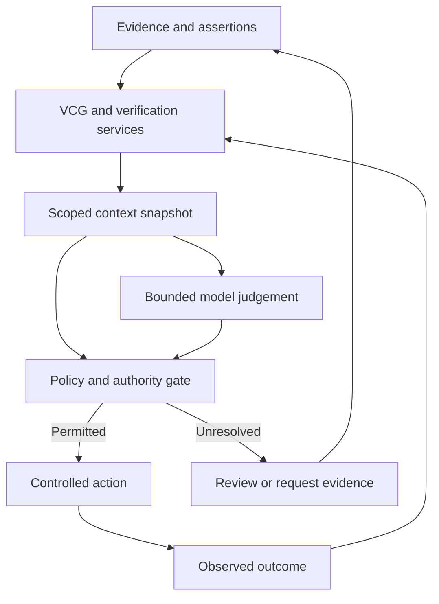

# From Typed Decisions to Accountable Intelligence

*How TypeSafe AI and Verified Context Graphs could combine probabilistic judgement, persistent evidence and governed action*

**18 September 2026 · Architecture and concept paper**

## Abstract

An intelligent system needs several distinct properties before an organisation can depend on its decisions. Its outputs must be usable by software; its uncertainty must be understood; its evidence must remain inspectable; and its actions must stay within delegated authority. Improving one property does not establish the others. This paper examines the relationship between TypeSafe AI’s approach to structured probabilistic decisions and Verified Context Graphs (VCGs), the proposed architecture developed in the Papers project for maintaining context, provenance, verification status and relationships over time. Its central thesis is that a bounded decision model could operate over a verified context snapshot, while an independent policy layer determines whether the resulting proposal can become an action. The graph would retain the evidence, model result, authorisation and observed outcome as distinct records. This separation could make intelligence more composable without allowing confidence to masquerade as truth or permission. The paper proposes an integration architecture, illustrates it through organisational evidence review, identifies failure modes and outlines an evaluation programme. It treats the integration as a design proposal, with benefits to be measured, rather than an existing TypeSafe capability or a demonstrated guarantee of autonomous reliability.

## 1. The decision needs a context that survives it

A model can make a useful judgement and still leave the surrounding organisation with an incomplete account of what happened.

Which evidence was available? Was that evidence current? Did the decision concern the right person, organisation or asset? Which policy applied? Who had authority to act? What should happen if a supporting assertion is later withdrawn?

These questions persist after the inference has finished. They concern the continuity of organisational knowledge and responsibility.

The connection explored here is therefore architectural: **place a bounded probabilistic decision inside a persistent, inspectable context and an independently enforced action boundary.**

The proposed combination assigns different work to different components. A decision model supplies judgement where interpretation is required. A VCG preserves the context and its evidence relationships. Deterministic software performs exact checks and enforces policy. People establish purposes, resolve contested interpretations and remain accountable for delegated authority.

Together, these components could make a decision reusable and challengeable across time.

## 2. What TypeSafe AI contributes

TypeSafe AI presents Jev as its first public System One Model, designed to return structured decisions with probabilities and confidence estimates. Its website describes software choosing when to act or request review through thresholds. These are the company’s published descriptions, not performance findings established by this paper. [TypeSafe AI](https://typesafe.ai/)

Its launch article, dated 15 September 2026, describes a new architecture, parallel sampling and Reinforcement Learning for Calibrated Decisions (RLCD). It identifies Jev as an early-access offering. [Introducing System One Models & Jev](https://typesafe.ai/blog/introducing-system-one-models-and-jev)

The company’s manifesto advocates composing semantic judgements with conventional software, leaving exact computation to code. That provides the conceptual starting point for this paper’s integration proposal. [TypeSafe AI manifesto](https://typesafe.ai/manifesto)

One distinction requires particular care. The launch article grounds its zero-type-error claim in guaranteed schema matching. It also explains that its workflow evaluations use other models’ predictions as reference probabilities. Neither establishes universal factual correctness. [Introducing System One Models & Jev](https://typesafe.ai/blog/introducing-system-one-models-and-jev)

For example, a classification of `current` can be perfectly well formed while referring to an expired document. A constrained output vocabulary prevents some structural failures; factual assessment still depends on evidence, interpretation and the question asked.

## 3. What a Verified Context Graph contributes

In the Papers project, a **Verified Context Graph** is a proposed graph of context whose statements, relationships, provenance, authority and changes can be checked. It preserves accepted information alongside uncertainty, contradictions and revision history.

“Verified” must describe a specific check. Verifying a signature establishes an integrity and attribution property. Checking a date establishes whether a recorded interval includes a particular time. Confirming a claim against independent evidence establishes a different property again.

A VCG should therefore record what was checked, by whom or by which mechanism, against which evidence, and within what scope. An authenticated assertion may remain factually mistaken. An accurate assertion may be outdated or irrelevant to the current decision.

The graph supplies continuity through explicit relationships: an assertion derives from a document; the document concerns an identified asset; a policy requires a particular property; a decision depended on that assertion; an action followed the decision under a recorded delegation.

This is also a boundary on reuse. Evidence can be reused only while its validity, purpose and access conditions remain satisfied. The graph must preserve missing evidence and unresolved disagreements instead of presenting a cleaner but misleading account.

## 4. Four properties that must remain separate

The proposed architecture distinguishes four questions.

| Property | Question | Example | What it does not establish |
|---|---|---|---|
| Structural validity | Does the result conform to the required schema? | A permitted category and a numeric score | That the selected category is correct |
| Statistical calibration | Do probability estimates correspond to observed correctness over relevant cases? | Predictions near 0.9 succeed roughly 90% of the time | Certainty about one decision |
| Context verification | Which checks support this assertion in this situation? | Issuer, scope and validity checks are recorded | That every statement from the issuer is true |
| Action authority | May this actor take this action under current conditions? | A valid delegation permits a bounded operation | That the operation is wise or its premise correct |

Calibration is a measurable relationship between probability estimates and outcomes across a population of cases. It is not simply a model emitting a confidence number. This distinction is established in the calibration literature. [Guo et al., 2017](https://proceedings.mlr.press/v70/guo17a.html)

For this architecture, calibration must be evaluated on the intended tasks and deployment conditions. A threshold that performs acceptably for reversible document routing is not automatically appropriate for consequential access changes.

The paper’s governing rule is that **no single score should collapse these four properties**. Strong evidence cannot create a missing delegation, and a high model probability cannot repair an expired credential.

## 5. A proposed integration architecture

The following architecture is a proposal. The reviewed sources do not establish an existing TypeSafe–VCG integration.

### 5.1 Prepare a bounded context

A deterministic query selects the relevant graph state, subject to access permissions. It includes evidence references, validity intervals, unresolved conflicts and the applicable policy version. The selected context receives a version or content identifier.

The query should have explicit requirements for necessary evidence. A small context is useful only if it preserves the information needed for the decision. Missing relationships must appear as unknowns; omission must not silently become a negative finding.

### 5.2 Ask for the judgement that is actually needed

Exact checks should execute in code. Comparing a stored expiry time with the current time does not require probabilistic interpretation.

The model could instead judge whether a document appears relevant to a particular requirement, whether two descriptions likely concern the same activity, or which review queue best fits an ambiguous submission. Its output would be recorded as an inference, linked to the context snapshot and the model invocation.

The surrounding workflow must support an unresolved outcome. If the model interface does not offer abstention directly, the application can implement it through validation, uncertainty thresholds and evidence requirements.

### 5.3 Enforce the action boundary

An independent gate checks evidence requirements, current delegation, policy constraints, model suitability and the consequences of the proposed action. Model confidence is an input to this gate; it cannot override failed authority checks.

Before executing, the gate must detect material changes since the snapshot. A revoked permission or superseded record may require a fresh evaluation. Transactional checks or equivalent version preconditions should prevent an action from using a state that is no longer applicable.

### 5.4 Record the consequence

The graph records the proposed decision, permission result, attempted action and observed outcome separately. A successful API response may establish that a request was accepted, while completion requires additional evidence.

Subsequent corrections should preserve the historical record and mark affected dependencies for reassessment. That allows an organisation to explain why a decision was reasonable at the time without continuing to treat its premises as current.

## 6. Worked example: organisational evidence review

Consider an organisation receiving a document intended to satisfy an operational requirement. The immediate task is to associate evidence with the correct requirement and route uncertainty appropriately.

Its VCG contains the submitting organisation, relevant asset or service, requirement version, existing evidence, known issuer relationships and reviewer delegations. The uploaded document enters as a new source assertion.

Software first checks the properties it can establish directly: file integrity, available signatures, supplied identifiers, recorded dates and access rights. Where a value was extracted through inference, that extraction retains its own status until appropriately checked.

A bounded model judgement then estimates which requirement the document supports and whether its stated scope appears consistent with the target activity. Suppose it assigns a high probability to the relevant category. That remains a semantic assessment.

The policy layer can now distinguish outcomes:

| Situation | Proposed response |
|---|---|
| Relevant document, required checks passed, low-consequence routing permitted | Attach it as supporting evidence with the recorded assessment |
| Relevant document, issuer authority unresolved | Request issuer verification |
| Strong semantic match, expired validity interval | Record it as historical evidence and request a current document |
| Conflicting scope or uncertain asset identity | Route to a qualified reviewer |
| Evidence appears sufficient, actor lacks approval authority | Preserve the assessment and refer the approval |

Attaching evidence should not silently mean that the entire organisation is compliant. Each transition requires a defined meaning and an appropriate authority.

If the issuer later withdraws the document, dependency links reveal which assessments relied on it. The organisation can prioritise reassessment while retaining the original decision record.

The value is the ability to maintain the relationship between evidence and consequence as circumstances change.

## 7. The graph can make uncertainty operational

A useful result needs more context than a label and a probability. This paper proposes a decision record containing:

| Record element | Purpose |
|---|---|
| Question and output-schema version | Identify exactly what was being judged |
| Selected result and probability information | Preserve the model’s assessment |
| Model identifier and available version information | Support comparison and investigation |
| Context snapshot and source references | Identify what the model actually received |
| Verification results and outstanding conflicts | Explain the condition of the evidence |
| Policy version and authority reference | Explain the permission decision |
| Action receipt and independently observed outcome | Distinguish intention from consequence |
| Expiry and dependency relationships | Support invalidation and reassessment |

These are application-level design requirements, not a representation of Jev’s API schema.

Over time, outcome records could support calibration studies for specific tasks and operating conditions. They could also show whether errors arise mainly from interpretation, missing context, faulty evidence or policy design.

Outcome collection must itself be disciplined. A human accepting a recommendation is not necessarily evidence that it was correct. Reviewing only uncertain cases also produces a biased sample. A credible evaluation should include independently assessed cases from automatically processed decisions.

The graph would support the evaluation by retaining relationships and history. It would not automatically retrain the model or make its probabilities reliable.

## 8. The inverse: efficient decisions over unreliable context

The failure condition is an organisation that makes decisions faster while weakening its ability to understand, challenge or reverse them.

One route is **promotion of inference into fact**. A model infers a relationship, the graph stores it without its inference status, and another model later treats it as verified evidence. Repetition then appears to create corroboration, although every conclusion traces to the same uncertain source.

A second route is **authority confusion**. The model recognises a document as plausible and software interprets that judgement as permission to act. A semantic category has crossed an authorisation boundary without a valid delegation.

A third route is **selective context**. Retrieval omits a contradiction or revocation, producing a convincing answer to an incomplete representation of the situation. The correctness of graph storage does not guarantee the adequacy of the selected subgraph.

A fourth route is **correlated error**. Several decisions may inherit the same mistaken source or interpretation. Multiplying their individual confidence values as though they were independent can misrepresent the reliability of the overall workflow.

The design response is to preserve origin and derivation, keep inference status explicit, check authority outside the model, and evaluate complete workflows against independently established outcomes.

## 9. Implications for conducting and organisational agency

This architecture changes where human attention is most valuable.

People establish objectives, define acceptable evidence, decide which consequences may be delegated, and maintain routes for challenge and correction. They also review whether the categories and thresholds themselves are fair and appropriate.

In the Papers project’s language, this is a role for **conducting**: holding direction and coordinating differentiated capabilities. A Conducting Score could express intended outcomes, permitted actions, evidence requirements, review points and conditions that require a pause.

The VCG would preserve the relevant organisational context. A decision model would contribute bounded judgement. Conventional software would enforce the resulting constraints. This division could reduce repetitive interpretation while preserving accountability for the rules governing action.

It could also support changing model providers without discarding organisational memory. That requires an application-owned data model, exportable provenance and explicit decision contracts. Replacement models would still need fresh evaluation; matching an output schema does not establish equivalent behaviour.

## 10. How to test the proposition

The proposed benefits should be evaluated through a narrow, reversible workflow before extending autonomy.

A suitable first study would use document classification and review routing, with historical cases assessed independently of the model being tested. It should compare a conventional structured-output model and a TypeSafe model, each with and without VCG-based context preparation. Holding policies and evaluation cases constant would help distinguish model effects from context effects.

| Evaluation dimension | What to measure |
|---|---|
| Decision quality | Task accuracy and consequence-weighted errors |
| Uncertainty quality | Reliability diagrams, probability scoring and errors at each automation threshold |
| Context quality | Missing prerequisites, omitted conflicts and incorrect entity associations |
| Authority enforcement | Whether expired or absent delegations block prohibited transitions |
| Change handling | Whether revocations and superseded evidence trigger reassessment |
| Operational value | Total cost and latency, including retrieval, verification and review |
| Human accountability | Ability to explain, challenge and correct a consequential decision |

Cases should include stale evidence, ambiguous identities, contradictory documents and changes between decision and execution. Record the proportion of work automated alongside its error rate, so that apparently better accuracy cannot conceal excessive abstention.

This study would not establish universal reliability. It would test a concrete claim: whether maintained context and bounded probabilistic judgement improve a particular workflow at an acceptable level of consequence.

## 11. Conclusion

The strongest connection between TypeSafe AI and Verified Context Graphs is a division of responsibilities that an organisation can inspect.

A model judgement becomes one event in a longer chain: evidence is acquired, context is checked, uncertainty is estimated, authority is evaluated, action occurs and consequences are observed. Each stage has its own meaning and conditions of validity.

The resulting architecture could let organisations compose intelligence while retaining the ability to revise what they know and explain what they did. Its success depends on preserving those distinctions throughout the system.

**Make judgement callable, context inspectable, authority explicit and consequences traceable.**

## References and scope

1. TypeSafe AI. [Product website](https://typesafe.ai/). Accessed 18 September 2026.
2. Almeida, D. [Introducing System One Models & Jev](https://typesafe.ai/blog/introducing-system-one-models-and-jev). TypeSafe AI, 15 September 2026.
3. TypeSafe AI. [Manifesto](https://typesafe.ai/manifesto). Accessed 18 September 2026.
4. Guo, C., Pleiss, G., Sun, Y. and Weinberger, K. Q. [On Calibration of Modern Neural Networks](https://proceedings.mlr.press/v70/guo17a.html). Proceedings of ICML, 2017, 70:1321–1330.

VCG, conducting and Conducting Score are used in the conceptual sense established in the Papers project. The integration, decision record, worked example and evaluation programme are proposals developed in this paper. No implementation, independent Jev benchmark or existing partnership is claimed.